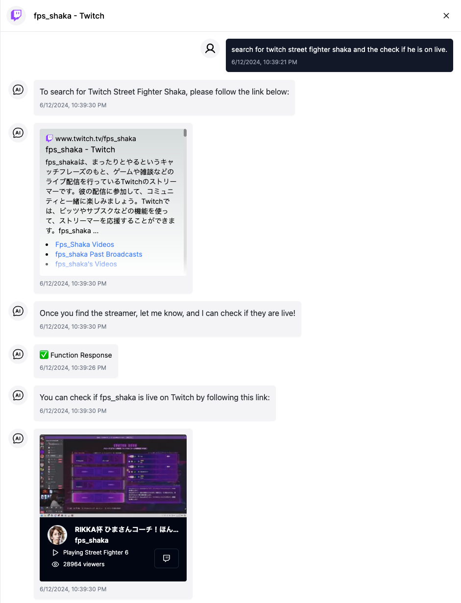

# What is Web Intents for LLMs?

With the rise of chatbots and other conversational interfaces, it's important to have a standard way to define the capabilities of a web service. This is where Web Intents for LLMs comes in. It's a protocol that allows web services to define their capabilities in a standard way so that chatbots and other conversational interfaces can easily interact with them.

> I've thought about using the term "Web Intents". Although it shares some commonalities with Web Intents, it is not the same thing as Google's proposed Web Intents API. So, to avoid any confusion, We've added "for LLMs" to the name.

## Example



The LLMs recognize the intent and then embed the interface in the chat. The user can then interact with the interface to get the information they need. Here is the web page that is embedded in the chat:

---
<iframe src="https://spellboard-twitch-intent.vercel.app?name=fps_shaka" width="300px" height="300px"></iframe>
---

## Breaking down the example

**The `intents.json`**

LLMs accept function calls, so we have to define the function that the LLMs will call. Here's the definition modified form OpenAI's function definition in JSON format:

```json
{
    "name": "is_streamer_live_on_twitch",
    "description": "Check if a streamer is live on Twitch by their login name.",
    "parameters": {
        "type": "object",
        "properties": {
            "login_name": {
                "type": "string",
                "description": "The streamer's login name."
            }
        },
        "required": [
            "login_name"
        ]
    },
    "async": true,
    "link": "/?name={login_name}",
    "example": "/?name=ninja",
    "returns": {
        "type": "object",
        "properties": {
            "response": {
                "type": "string",
                "description": "The information of the streamer."
            }
        }
    }
}
```

With this definition, LLMs based chatbots can call the function `is_streamer_live_on_twitch` by extracting the function call related information from JSON and pass it to the completion APIs.

You can check OpenAI's completion API [here](https://platform.openai.com/docs/api-reference/chat/create#chat-create-tools). The difference between OpenAI's completion API and this is that we add the following fields:

1. `link`: The link to the web service that will be called.
2. `example`: An example of the link with the parameters filled in.
3. `returns`: The return value of the function.

You can also visit the json file at https://spellboard-twitch-intent.vercel.app/intents.json

## How to make it run on SpellBoard

1. create a `intents.json` file and place it in the root of your web service.
2. make your site embedable by disable the iframe protection.
    1. `X-Frame-Options`: set the header of your site to `ALLOW-FROM https://spellboard.getmegaportal.com/` or disable it.
    2. `Content-Security-Policy`: set the header of your site to `frame-ancestors 'self' https://spellboard.getmegaportal.com/` or disable it.
    3. Make your cookie `SameSite=None; Secure` if you are using cookies.
    4. Any other security measures that you have in place that might prevent your site from being embedded in an iframe.
3. Visit `https://spellboard.getmegaportal.com/?appUrl=${encodeURIComponent('https://your-site.com')}` to test your site.

## Try the demo yourself

You can try the demo yourself by visiting [here](https://spellboard.getmegaportal.com/?appUrl=https%3A%2F%2Fspellboard-twitch-intent.vercel.app) and then clicking the "Chat" button.

## Demo Source Code

You can find the source code for the demo at [here](https://github.com/MegaPortal/spellboard-twitch-intent)

## Triple-Win Strategy for Enhancing User Experiences with LLM-Based Platforms

We think here's how it may work from a triple-win perspective:

1. Users care about the outcome and enriched user experiences without needing to learn how to use the app first. So, cut to the chase.

2. Third-party app providers want their data protected and not leaked to LLM providers. Most importantly, it provides a way to convert traffic to their own sites, similar to what they expect from a search engine, rather than being replaced by a feature of an LLM-based app.

3. LLM-based platforms require little effort to support this and can monetize by replicating traditional methods of recommending and advertising apps.